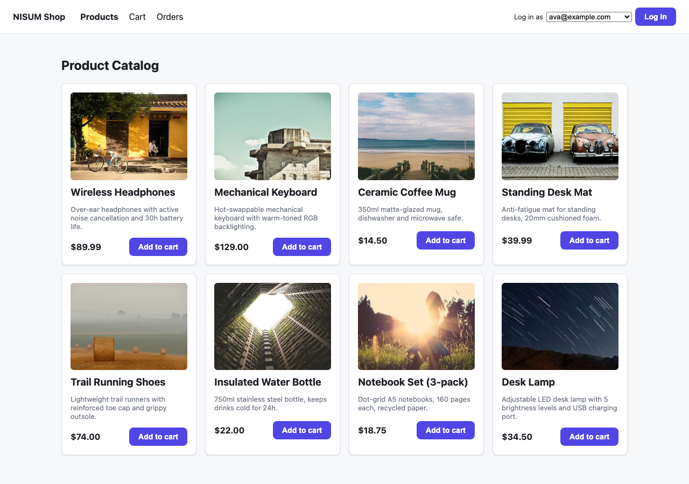
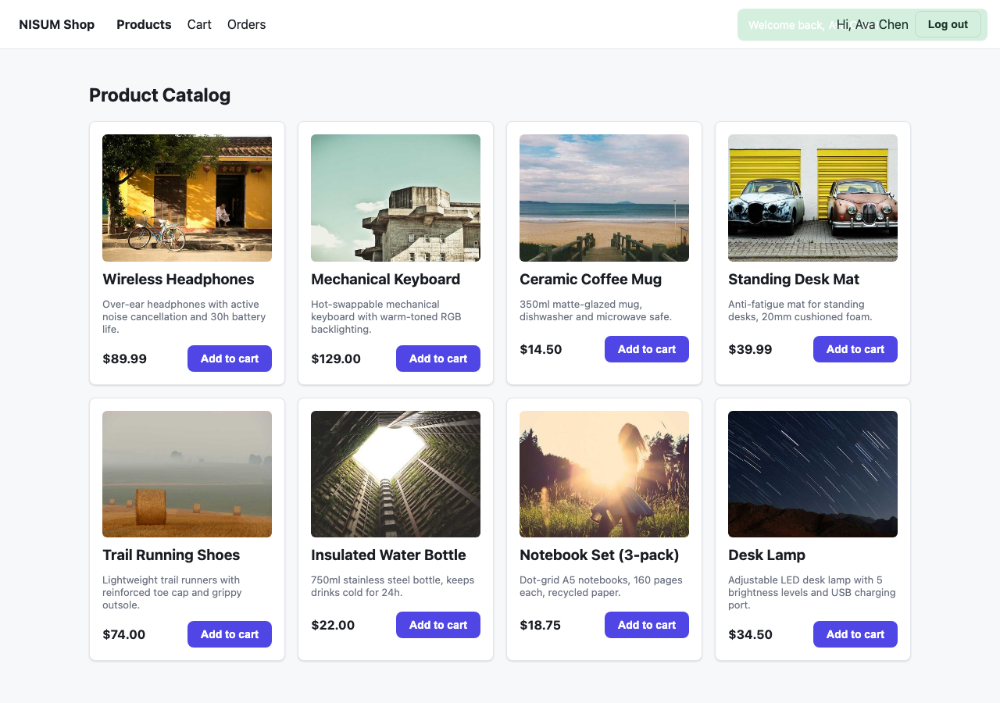
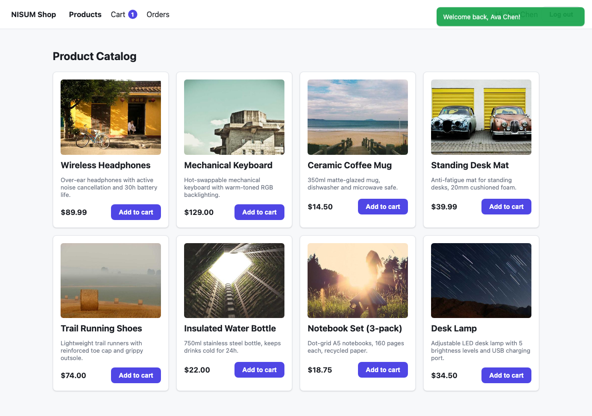
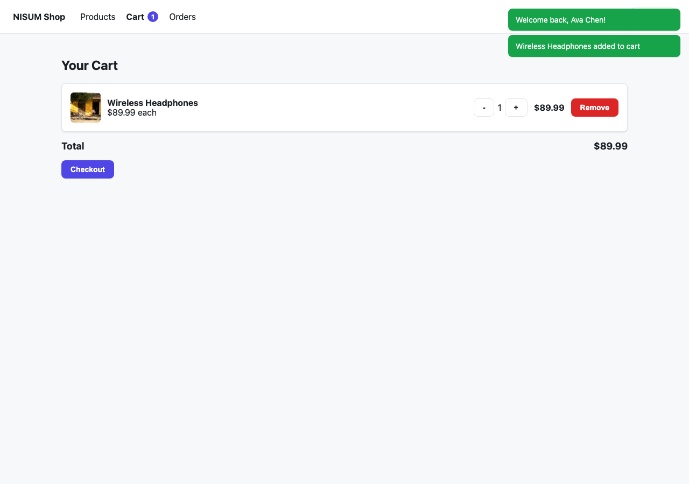
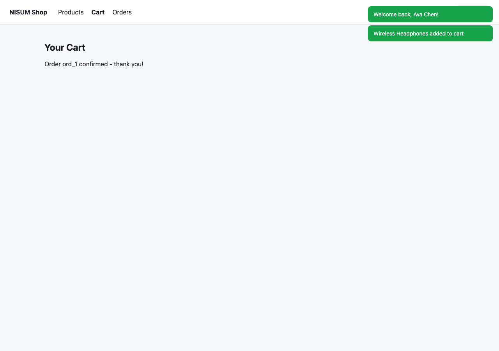
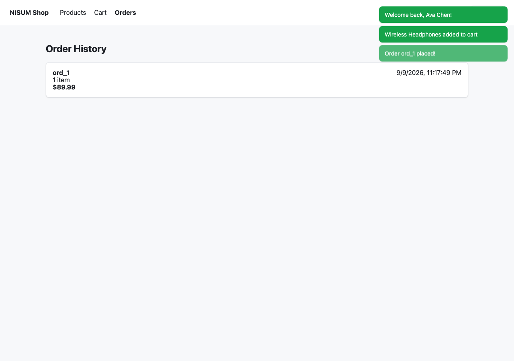

# NISUM Shop — Micro Frontend E-Commerce Platform

Final project for the Micro Frontend (MFE) Training: a production-shaped e-commerce platform built as a Gateway + three independently-developed Micro Frontends, a shared Redux store, a `window.NISUM` event bus, and an Express backend — composed at runtime via Webpack Module Federation inside an npm-workspaces monorepo.

## Overview

This isn't a single app split into folders — it's four separately-built frontend applications (a gateway/shell and three MFEs), each independently runnable, independently testable, and independently deployable, that only know about each other through three explicit contracts: a shared Redux store, a shared browser event bus (`window.NISUM`), and a REST API. The goal was to make every one of those contracts do real work — not exist as a demo stub — and to document why each one was chosen over the alternatives.

## Business Scenario

**E-commerce**, extending the domain used earlier in this training (Assignments 1 and 2: a routed shell + a shared cart across catalog/cart MFEs). Three MFEs give three genuinely distinct business responsibilities, a natural piece of shared state (the cart), and a natural event chain (`product → cart → order`):

- **Product Catalog** — browse products, add to cart.
- **Cart** — review, adjust, and check out the cart.
- **Orders** (3rd/bonus MFE) — order history for the logged-in user.

## Architecture

```
                         ┌─────────────────────────┐
                         │   Gateway / Shell (Host) │
                         │  routing · nav · auth ·  │
                         │  error boundaries        │
                         └────────────┬─────────────┘
                                      │ Module Federation (runtime)
              ┌───────────────────────┼───────────────────────┐
              │                       │                       │
      ┌───────▼───────┐      ┌────────▼────────┐     ┌────────▼────────┐
      │  Product MFE   │      │    Cart MFE     │     │   Orders MFE    │
      │  :3001         │      │    :3002        │     │   :3003         │
      └───────┬────────┘      └────────┬─────────┘     └────────┬────────┘
              │                        │                        │
              └───────────┬────────────┴────────────┬───────────┘
                           │                         │
                 ┌─────────▼─────────┐     ┌─────────▼─────────┐
                 │  Shared Redux      │     │  window.NISUM     │
                 │  Store (cart, auth)│     │  event bus         │
                 │  @nisum-mfe/state  │     │  @nisum-mfe/events │
                 └────────────────────┘     └────────────────────┘
                           │
                 ┌─────────▼─────────┐
                 │   Backend API      │
                 │   Express :4000    │
                 └────────────────────┘
```

Every app also independently talks to `libs/shared-ui`, `libs/shared-types`, and `libs/utilities` (not drawn above to keep this readable) — see [Shared Libraries](#shared-libraries).

## Technologies Used

| Layer | Choice | Why |
|---|---|---|
| Module Federation | Webpack 5 `ModuleFederationPlugin` | Matches Assignment 2's precedent in this training; mature, well-documented `shared`/singleton semantics. |
| Monorepo | npm workspaces | Matches Assignments 1.1/2's precedent; zero extra tooling to learn beyond npm itself (see [Architecture Decisions](#architecture-decisions) for the Nx trade-off). |
| Language | TypeScript everywhere (frontend + backend) | One type system end to end; `@nisum-mfe/shared-types` is the single source of truth for domain shapes. |
| UI | React 18 | Required by the training; `react-redux` context works cleanly across federated remotes rendered in the same tree. |
| Global state | Redux Toolkit | Predictable, serializable, easy to make a true cross-remote singleton via MF `shared`. |
| Backend | Express + TypeScript | Minimal, fast to reason about; in-memory seeded data keeps the project self-contained (no DB to provision). |
| Testing | Vitest + Testing Library + Supertest | Matches Assignment 2's precedent; fast, native ESM, one config shape reused across every workspace. |
| CI/CD | GitHub Actions | Required; GitHub Pages for best-effort static deploy (see [Deployment](#deployment)). |
| Containers | Docker + docker-compose | Bonus: the whole platform boots with one command from clean containers. |

## Project Structure

```
apps/
  gateway/       host — layout, routing, auth widget, error boundaries        (:3000)
  mfe-product/   remote — product catalog, exposes ./ProductApp               (:3001)
  mfe-cart/      remote — cart + checkout, exposes ./CartApp                  (:3002)
  mfe-orders/    remote — order history, exposes ./OrdersApp                  (:3003)
  api/           Express + TypeScript backend                                 (:4000)
libs/
  shared-types/  @nisum-mfe/shared-types — Product, CartItem, Order, User, NisumEventMap
  shared-ui/     @nisum-mfe/shared-ui — Button, Card, Badge, Spinner, ErrorBoundary, NotificationCenter
  state/         @nisum-mfe/state — Redux store (authSlice, cartSlice), typed hooks
  events/        @nisum-mfe/events — the NISUM event bus + useNisumListener hook
  utilities/     @nisum-mfe/utilities — env reader, fetchJson, formatCurrency, logger
docker/          (Dockerfile lives per-app; see Deployment)
.github/workflows/
  ci.yml         install → lint → typecheck → test → build
  cd.yml         best-effort static deploy to GitHub Pages
docker-compose.yml
```

Every `apps/*` and `libs/*` package has its own `package.json`, `tsconfig.json`, and (where it has tests) `vitest.config.ts` — each is a real, independent unit, not a folder-of-convenience.

## Applications

### Gateway

The Module Federation **host** and the only app with routing (`react-router-dom`) and layout. Responsibilities:

- Loads the three remotes at **runtime** via `React.lazy(() => import('mfeProduct/ProductApp'))` etc. (see [`src/remotes.ts`](apps/gateway/src/remotes.ts)).
- Wraps every routed remote in a `RemoteBoundary` (`ErrorBoundary` + `Suspense`, see [`src/components/RemoteBoundary.tsx`](apps/gateway/src/components/RemoteBoundary.tsx)) so a remote that's down or crashes shows a "module unavailable, retry" panel **without taking down the rest of the shell**.
- Owns the mock login widget ([`src/components/AuthWidget.tsx`](apps/gateway/src/components/AuthWidget.tsx)) and the cart badge in the nav.
- Attaches the shared event bus to `window.NISUM` exactly once, at bootstrap (see [`src/bootstrap.tsx`](apps/gateway/src/bootstrap.tsx)).

### MFE 1 — Product Catalog (`mfe-product`)

Fetches the catalog from `GET /api/products`, renders it, and is the primary **event emitter**: clicking "Add to cart" both dispatches into the shared cart slice and emits `cart:item-added` on NISUM (see [`src/components/ProductCard.tsx`](apps/mfe-product/src/components/ProductCard.tsx) — the one interaction in this project that deliberately goes through both data-sharing mechanisms at once). Includes a feature-flagged "Recommended products" section gated by `ENABLE_RECOMMENDATIONS`.

### MFE 2 — Cart (`mfe-cart`)

Reads the cart directly from the shared Redux store (state sharing) and separately **listens** for `cart:item-added` (event sharing) purely to briefly highlight the row that was just added — a concern the store has no reason to know about (see [`src/App.tsx`](apps/mfe-cart/src/App.tsx)). Checkout posts to `POST /api/orders`, then emits `order:created`.

### MFE 3 (bonus) — Orders (`mfe-orders`)

Reads the logged-in user from shared state, fetches `GET /api/orders?userId=`, and **refetches automatically** on `order:created` — the checkout → order-history handoff happens purely over the event bus, with zero direct import between the Cart and Orders apps.

### Backend

Express + TypeScript, in-memory seeded data (see [Backend/API](#backendapi)).

## Module Federation

- **Host**: gateway. **Remotes**: `mfeProduct`, `mfeCart`, `mfeOrders`.
- Each remote exposes exactly one page-level component (`./ProductApp`, `./CartApp`, `./OrdersApp`) — a plain component with no `<Provider>`/root of its own, so it renders inside the gateway's existing React tree and shares Redux context. Each remote *also* has its own `src/index.tsx` → `src/bootstrap.tsx` bootstrap (with its own `<Provider>`) so it is **independently runnable** with `npm run dev` from inside its own folder — see the "Independent Deployment" note below for why both exist.
- **Shared singletons** in every `ModuleFederationPlugin` config: `react`, `react-dom`, `react-redux`, `@reduxjs/toolkit`, `react-router-dom` (host only), and — the load-bearing part — the workspace libraries `@nisum-mfe/state` and `@nisum-mfe/events` are *also* marked `singleton: true`. That's what makes "shared state" and "the event bus" actually the same runtime instance across four independently-built bundles, not four structurally-identical copies.
- Every federated entry point (`src/index.tsx`) does `import('./bootstrap')` rather than importing React directly — the standard workaround so Module Federation's async shared-scope negotiation completes before any shared module is evaluated ("eager consumption" otherwise throws at runtime).
- **Remote URLs are never hardcoded.** Each `webpack.config.js` reads them from `.env` (`PRODUCT_MFE_URL`, `CART_MFE_URL`, `ORDERS_MFE_URL`, `API_URL`) via `dotenv`, with `.env.example` committed per app and the real `.env` gitignored.
- **Failure isolation**: `src/remotes.ts` wraps every remote `import()` in a `.catch()` that logs and rethrows, and the gateway's `RemoteBoundary` (`ErrorBoundary` + `Suspense`) catches it — a remote that's offline, mid-deploy, or throwing at runtime degrades to a fallback panel with a **Retry** button; the other two remotes and the shell keep working. Verified manually by stopping the cart MFE's dev server and confirming `/cart` shows the fallback while `/` and `/orders` stay fully functional.

### Independent deployment

- Each app has its own `package.json`, its own dev server/port, and its own `Dockerfile` — none of them import another app's source.
- The gateway discovers remotes purely by URL (`PRODUCT_MFE_URL` etc.), resolved at **build time** for that specific gateway build. Redeploying `mfe-product` to a new URL only requires rebuilding the gateway with the new env var — no changes to `mfe-product` itself, and no changes to the other two MFEs at all.
- **Version compatibility**: `requiredVersion` on every shared singleton (read from each app's own `package.json`) means a version mismatch across independently-deployed apps fails loudly (a webpack runtime warning/error) instead of silently loading two incompatible copies of React or Redux Toolkit.
- **When a remote is unavailable**: see the failure-isolation paragraph above — this is the actual production concern this pattern is meant to answer, and it's implemented, not just described.

## Monorepo Architecture

**npm workspaces**, not Nx. `package.json`'s `workspaces` field lists `libs/*` and `apps/*`; every workspace package is symlinked into the root `node_modules`. Libraries are consumed **from TypeScript source**, not a pre-built `dist` — each app's `babel-loader` rule excludes `node_modules` **except** `@nisum-mfe/*`, so a lib change is picked up by every consuming app's dev server immediately, with no separate "build the shared lib first" step. See [Architecture Decisions](#architecture-decisions) for why this over Nx.

## Shared Libraries

| Library | Package | Contains |
|---|---|---|
| `shared-types` | `@nisum-mfe/shared-types` | `Product`, `CartItem`, `Order`, `User`, and `NisumEventMap` (the compile-time contract for every NISUM event name + payload) |
| `shared-ui` | `@nisum-mfe/shared-ui` | Generic, business-agnostic components: `Button`, `Card`, `Badge`, `Spinner`/`LoadingPanel`, `ErrorPanel`, `ErrorBoundary`, `NotificationCenter` |
| `state` | `@nisum-mfe/state` | The Redux Toolkit store, `authSlice`, `cartSlice`, typed `useAppDispatch`/`useAppSelector` |
| `events` | `@nisum-mfe/events` | The NISUM event bus, `attachNisumToWindow`, the `useNisumListener` React hook |
| `utilities` | `@nisum-mfe/utilities` | `readEnv`/`readBoolEnv`, `fetchJson` (centralized API error handling), `formatCurrency`, `createLogger` |

`shared-ui` deliberately contains **no** cart/order/product-specific components — `NotificationCenter` only knows about the generic `notification:show` event, not about carts.

## Global State

Redux Toolkit store in `@nisum-mfe/state`, shared as a **Module Federation singleton** (see [Module Federation](#module-federation)):

```ts
{
  auth: { user: { id, name, email } | null },
  cart: { items: CartItem[] }   // totals derived via selectors
}
```

- **`cartSlice`**: Product MFE dispatches `addItem`; Cart MFE reads it via `selectCartItems`/`selectCartTotalPrice` and dispatches `updateQuantity`/`removeItem`/`clearCart`; the gateway reads `selectCartTotalItems` for the nav badge. Three independently-built apps genuinely depend on the same store instance — this is not decorative.
- **`authSlice`**: set by the gateway's mock login widget; read by the Cart MFE (checkout is gated on being logged in) and the Orders MFE (which order history to fetch).
- Both slices are persisted to `localStorage` and synced across browser tabs via the `storage` event (see [Data-Sharing Strategy](#data-sharing-strategy) row 4).

## Event-Driven Architecture

```
Product MFE                         Cart MFE
   │  NISUM.emit('cart:item-added') │
   └────────────► window ───────────┴──► NISUM.listener('cart:item-added')
                     │                         (highlights the new row)
                     └──► Gateway's NotificationCenter (toast)

Cart MFE                            Orders MFE
   │  NISUM.emit('order:created')   │
   └────────────► window ───────────┴──► NISUM.listener('order:created')
                                              (refetches order history)
```

| Event | Emitted by | Listened by | Purpose |
|---|---|---|---|
| `cart:item-added` | Product MFE | Cart MFE, Gateway | Notify without coupling Product → Cart internals |
| `cart:item-removed` | *(reserved — see Future Improvements)* | — | |
| `product:selected` | Product MFE | Gateway | Cross-cutting notification/logging |
| `order:created` | Cart MFE | Orders MFE, Gateway | Checkout → order-history handoff |
| `user:login` / `user:logout` | Gateway auth widget | (any app can subscribe) | Auth transition, alongside the `authSlice` state change |
| `notification:show` | any app | Gateway `NotificationCenter` | Generic reusable toast channel |

## NISUM Event System

Built on the browser's native `CustomEvent` / `EventTarget` — not a bespoke pub-sub implementation, so it works identically everywhere and needs no polyfill (see [`libs/events/src/eventBus.ts`](libs/events/src/eventBus.ts)):

```ts
NISUM.emit('cart:item-added', { productId: '123', name: 'Mug', quantity: 1, price: 9.99 });

const unsubscribe = NISUM.listener('cart:item-added', (data) => {
  console.log(data); // fully typed via NisumEventMap
});
unsubscribe(); // always available — every listener is cleanly removable
```

- **Type-safe**: `emit`/`listener` are generic over `NisumEventMap` (in `shared-types`), so the event name and payload shape are checked at compile time.
- **Attached to `window`**: `attachNisumToWindow()` runs once at the gateway's bootstrap and is idempotent (`if (!window.NISUM)`), so a remote that happens to run standalone doesn't clobber the shared instance.
- **Listener cleanup**: the `useNisumListener(event, handler)` React hook (in `libs/events`) subscribes on mount and unsubscribes on unmount automatically — used in every MFE that listens for an event, so there is no listener-leak path through normal route navigation.
- **Tested**: `libs/events/src/__tests__/eventBus.test.ts` covers emit/listener/payload/unsubscribe/event-isolation.

## Data-Sharing Strategy

| Mechanism | Used for | Coupling | Persistence | Advantages | Limitations |
|---|---|---|---|---|---|
| **Shared State** (Redux, MF singleton) | Cart contents, current user | Higher — consumers depend on a specific slice shape | Runtime + `localStorage` | Simple, synchronous reads; one source of truth for "what is the cart right now" | Every consumer is coupled to the store shape; harder to evolve without touching every reader |
| **Events** (NISUM/window) | Cross-MFE notifications (`cart:item-added`, `order:created`, `user:login`) | Low — emitter and listener never import each other | Runtime only (nothing replays past events) | Fully decoupled; new listeners can be added without touching the emitter | Harder to trace/debug than a direct call; no guaranteed delivery order across listeners |
| **Module Federation shared modules** | `react-redux`, `@reduxjs/toolkit`, `@nisum-mfe/state`, `@nisum-mfe/events` | Medium — apps agree on a shared dependency *version* | Runtime (one instance per page load) | Makes shared state/events possible at all across separately-built bundles; avoids bundling duplicate React instances | Version-mismatch failures are a real class of bug; adds build config complexity |
| **Browser Storage** (`localStorage` + `storage` event) | Cart/auth persistence across reloads; cross-tab sync | Low | Persistent (survives refresh, shared across tabs) | Free persistence; no backend round-trip; the `storage` event gives cross-tab sync almost for free | Per-browser only; no cross-device sync; storage quota/private-mode edge cases (handled — see [Error Handling](#error-handling)) |
| **Backend API** (REST) | Product catalog, order creation/history, mock login | Low — pure HTTP contract | Server-side (source of truth) | Central source of truth; works across devices/sessions | Network dependency; requires explicit loading/error states (implemented in every hook) |

**Why not just one mechanism for everything?** Putting notifications in Redux would mean every listener re-renders on every dispatch and the store fills with transient "an event happened" noise. Putting the cart itself only in events would mean every consumer has to independently reconstruct and cache "what's in the cart right now" — exactly the bug class shared state exists to avoid. The add-to-cart flow in this project deliberately uses **both**, on the same user action, so the trade-off is visible in the running app rather than only in this table.

## Backend/API

Express + TypeScript, in-memory seeded data (`apps/api/src/data/*`) — no external DB, so the project is self-contained.

| Method | Route | Description |
|---|---|---|
| `GET` | `/api/products` | List products (optional `?category=`) |
| `GET` | `/api/products/:id` | One product, `404` if unknown |
| `POST` | `/api/orders` | Create an order from `{ userId, items }`, `400` on invalid body |
| `GET` | `/api/orders?userId=` | List a user's orders, `400` if `userId` missing |
| `POST` | `/api/auth/login` | Mock login by email against seeded users, `401` if unknown |
| `GET` | `/api/health` | Health check (uptime, timestamp) |

CORS is restricted to the configured frontend origins (`CORS_ORIGINS` env var); `morgan` request logging is on outside of tests; a centralized `errorHandler` middleware returns a consistent `{ error, message }` JSON shape.

## Error Handling

| Scenario | Handling |
|---|---|
| Remote MFE unavailable | Gateway's `RemoteBoundary` (`ErrorBoundary` + `Suspense`) shows "Module unavailable" + Retry; other routes keep working. Tested in `apps/gateway/src/__tests__/RemoteBoundary.test.tsx` and verified manually by killing an MFE's dev server. |
| Backend unavailable / network error | `fetchJson` (in `@nisum-mfe/utilities`) normalizes network failures into a typed `ApiRequestError`; every data hook (`useProducts`, `useOrders`, `useCheckout`) surfaces it via `ErrorPanel` with a Retry button. |
| API error response (4xx/5xx) | Same `fetchJson` path — the backend's `{ error, message }` body is surfaced as the panel's message. |
| Loading states | Every async hook exposes a `loading` status rendered as `LoadingPanel`/`Spinner`; the gateway shows one per remote while its chunk downloads. |
| Invalid/unexpected API data | Hooks guard with `Array.isArray(...)` before rendering; the orders/cart forms validate shape server-side too (`apps/api/src/routes/orders.ts`). |
| Event listener cleanup | `useNisumListener` unsubscribes in its `useEffect` cleanup — verified by the unsubscribe test in `libs/events`. |
| `localStorage` unavailable (private mode, quota) | `@nisum-mfe/state`'s persistence and initial-load paths are wrapped in `try/catch` and log a warning instead of crashing — the app runs correctly with no persistence rather than throwing. |

## Testing

Vitest + Testing Library (+ Supertest for the API) across every workspace — **47 tests, all green** (`npm test`):

| Workspace | Covers |
|---|---|
| `libs/events` | `NISUM.emit`/`listener`, payload delivery, unsubscribe, multi-listener, event isolation |
| `libs/state` | `cartSlice`/`authSlice` reducers, selectors, store shape |
| `libs/shared-ui` | `ErrorBoundary` renders children / catches errors / recovers on Retry |
| `apps/api` | `/api/products`, `/api/orders` — happy path + validation errors, via Supertest against the real Express app |
| `apps/gateway` | Shell renders, nav switches routes, `RemoteBoundary` shows a loading state / renders the resolved remote / shows a fallback on a rejected import (without needing a live federated remote) |
| `apps/mfe-product` | Renders the catalog from a mocked API; "Add to cart" both dispatches `addItem` **and** emits `cart:item-added`; API failure shows the error state |
| `apps/mfe-cart` | Reads cart items from the shared store; highlights a row on `cart:item-added`; blocks checkout when logged out; full checkout emits `order:created` and clears the cart |
| `apps/mfe-orders` | Prompts to log in when logged out; lists orders for the current user; refetches on `order:created` |

Run everything: `npm test`. Run one workspace: `npm test --workspace=mfe-cart`.

## CI/CD

- **CI** (`.github/workflows/ci.yml`, on every push/PR): `npm ci` → `npm run lint` → `npm run typecheck` → `npm test` → `npm run build`, across every workspace.
- **CD** (`.github/workflows/cd.yml`, on push to `main`): builds the gateway + all three MFEs with production `PUBLIC_PATH`/remote URLs pointed at GitHub Pages subpaths (`/gateway/`, `/mfe-product/`, `/mfe-cart/`, `/mfe-orders/`) and publishes via `peaceiris/actions-gh-pages`. This is genuinely automated for the **frontend** apps. The **backend is not auto-deployed** — see [Deployment](#deployment) for why and what it would take.

## Environment Configuration

No environment-specific URL is hardcoded anywhere in application code. Every app has a committed `.env.example` and a gitignored `.env`:

| App | Key vars |
|---|---|
| `api` | `PORT`, `CORS_ORIGINS` |
| `gateway` | `PUBLIC_PATH`, `API_URL`, `PRODUCT_MFE_URL`, `CART_MFE_URL`, `ORDERS_MFE_URL` |
| `mfe-product` | `PUBLIC_PATH`, `API_URL`, `ENABLE_RECOMMENDATIONS` (feature flag) |
| `mfe-cart` | `PUBLIC_PATH`, `API_URL` |
| `mfe-orders` | `PUBLIC_PATH`, `API_URL` |

Frontend vars are read at **build time** via webpack `DefinePlugin` (browser code) or directly in `webpack.config.js` via `dotenv` (Node-side config like MF `remotes`/`publicPath`). No secrets exist in this project (mock auth has no passwords/tokens to leak), but the `.gitignore` still excludes real `.env` files on principle.

## Running the Application

```bash
npm install
cp apps/api/.env.example apps/api/.env
cp apps/gateway/.env.example apps/gateway/.env
cp apps/mfe-product/.env.example apps/mfe-product/.env
cp apps/mfe-cart/.env.example apps/mfe-cart/.env
cp apps/mfe-orders/.env.example apps/mfe-orders/.env
npm run dev
```

```
Starting applications...

✓ API            http://localhost:4000
✓ Product MFE    http://localhost:3001
✓ Cart MFE       http://localhost:3002
✓ Orders MFE     http://localhost:3003
✓ Gateway        http://localhost:3000   <- open this one

Application ready.
```

Equivalent one-liner with Docker (no Node install needed): `docker compose up --build`.

Run one app standalone (e.g. to work on the product catalog in isolation): `npm run dev --workspace=mfe-product` and open `http://localhost:3001` directly.

## Deployment

- **Implemented**: `.github/workflows/cd.yml` builds and publishes the gateway + all three MFEs to GitHub Pages under independent subpaths on every push to `main` — a real, working example of independently-deployable static federated apps served from one static host.
- **Documented, not automated**: the backend. It needs a process host (Render/Fly.io/Railway/a VM), which needs an account and secrets this repo doesn't have. To wire it up: deploy `apps/api` (its `Dockerfile` already works standalone — `docker build -f apps/api/Dockerfile .`), then set the `API_URL` **repository variable** in GitHub Actions settings to that host's URL so `cd.yml` bakes the right value into the frontend builds.
- **Local, containerized**: `docker-compose.yml` builds and runs all five services from clean images — gateway/MFEs as multi-stage builds (Node → static assets served by `nginx`), API as a Node runtime image. This is the fastest way to prove the whole platform boots from nothing but Docker.

## Architecture Decisions

- **npm workspaces over Nx.** Nx is recommended by the brief, but every prior assignment in this training used plain npm workspaces + webpack, and this project's dependency graph (5 apps, 5 libs, one shared version of everything) doesn't need Nx's task-graph caching or generators to stay manageable. Trade-off: no built-in affected-project detection in CI — `npm run build` always builds everything, which is fine at this scale but wouldn't be at 50 apps.
- **Libraries consumed from source, not pre-built `dist`.** Avoids a "did you remember to rebuild `shared` first" class of bug (which Assignment 2's `build:shared` script existed to paper over) at the cost of every app's webpack having to transpile a few extra `node_modules/@nisum-mfe/*` files — a deliberate, explicit trade in the babel-loader `exclude` regex.
- **Exposed remote = pure component, not a mounted app.** Keeps the Provider/store wiring in exactly one place per "mode" (federated vs. standalone `bootstrap.tsx`) instead of every remote needing to detect which mode it's in at runtime.
- **Mock authentication, not real auth.** Implementing real session/token auth was out of scope for what this project is trying to demonstrate (cross-MFE state/event sharing); the mock still exercises the real thing this project cares about — "current user" as genuine shared state read by two independent MFEs — without a password/token surface that would need to be threaded through every app for no pedagogical benefit.
- **Cart is Redux + `localStorage`, not a backend resource.** The cart is inherently client/session state until checkout; treating it as backend-of-record would mean a network round-trip for every quantity change. Orders (once placed) *are* backend-of-record, which is the actual point where "shared state" should stop being the source of truth — see the Data-Sharing table.
- **In-memory backend data, no database.** Keeps the whole project runnable with zero external services. Documented explicitly as a trade-off, not hidden: restarting `apps/api` resets all orders.
- **CD deploys the frontend only.** See [Deployment](#deployment) — automating a backend deploy would require secrets/accounts this repo doesn't have; documenting the gap honestly was judged better than faking it with a workflow that can't actually succeed.

## Challenges & Solutions

- **`import './global'` (a `.d.ts`-only file) broke Vite's test resolver**, even though `tsc` compiled it fine (ambient global augmentation files aren't real runtime modules). Fixed by switching to a `/// <reference path="./global.d.ts" />` triple-slash directive in `eventBus.ts` — compile-time-only inclusion, no runtime import for the bundler to choke on.
- **Testing federated remotes that don't exist at test time.** The gateway's tests can't literally resolve `import('mfeProduct/ProductApp')` (Module Federation only resolves that at runtime via webpack). Solved two ways: (1) `App.test.tsx` mocks the local `../remotes` module rather than the federation-only specifiers, and (2) `RemoteBoundary.test.tsx` tests the actual loading/error/success states directly against a hand-built `React.lazy` component, independent of Module Federation entirely.
- **Node 22+'s native `localStorage` global shadowed jsdom's in Vitest**, causing `window.localStorage.clear is not a function` in component tests. Rather than fight the test environment, this surfaced a real gap worth having anyway: `@nisum-mfe/state`'s persistence code now degrades gracefully (try/catch + a warning log) instead of assuming `localStorage` is always fully functional — which is also correct behavior for private-browsing/quota-exceeded cases in real browsers.
- **Keeping "shared state" and "events" from overlapping into the same responsibility.** Early draft had the cart-added notification also live in Redux (a `notifications` array). Moved it to a pure NISUM event once it became clear nothing needed to *query* "was an item just added" after the fact — only react to it once. That's the dividing line documented in the [Data-Sharing Strategy](#data-sharing-strategy) table.

## Screenshots / Demo

All captured from a live run of `npm run dev` against a headless Chromium session (Playwright), with zero console errors throughout.

**Gateway loading all three federated remotes** (Product Catalog is the default route):


**Mock login** (dispatches into `authSlice`, emits `user:login`):


**Add to cart** — dispatches `addItem` and emits `cart:item-added` in the same click:


**Cart MFE reading the shared store** (item added from the *Product* MFE, rendered by the *Cart* MFE):


**Checkout** — `POST /api/orders`, then `order:created` is emitted:


**Orders MFE receiving `order:created`** from the Cart MFE and refetching automatically:


## Future Improvements

- Emit `cart:item-removed`/`cart:updated` (types already reserved in `NisumEventMap`) and have the gateway's badge animate off them, for full parity with the add-side events.
- Replace mock auth with real sessions (JWT + httpOnly cookie) once there's an actual reason to protect a route server-side.
- Nx (or Turborepo) if this grows past ~10 apps and CI build time starts to matter — the workspace boundaries already drawn here would translate directly into Nx project boundaries.
- A persisted-order backend (real DB) instead of in-memory, so `apps/api` restarts don't lose order history.
- Automate the backend deploy in `cd.yml` once a target host/account is available (see [Deployment](#deployment)).

## Conclusion

Every requirement in the brief maps to a specific, running piece of this repo rather than a description of one: the gateway really does compose three separately-built remotes at runtime and really does degrade gracefully when one is down; the cart really is one Redux store instance shared by three apps, not three copies; `window.NISUM` really is reachable from the browser console and really is what connects the Product, Cart, and Orders MFEs; and the whole thing is provable in one command (`npm run dev` or `docker compose up`) rather than only in prose.
